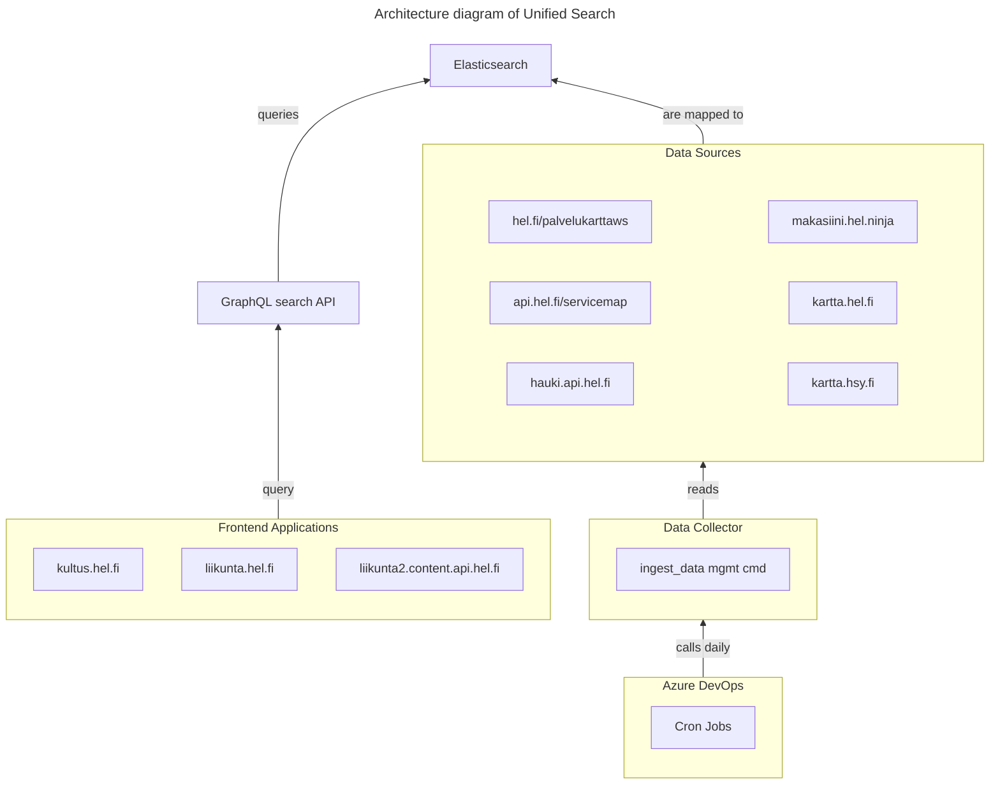

# Common unified search

This is common unified search: multi domain search over multiple services.

**Table of Contents**
<!-- DON'T EDIT THE TOC SECTION, INSTEAD RE-RUN md-toc TO UPDATE IT -->
<!--TOC-->

- [Applications](#applications)
  - [Elasticsearch](#elasticsearch)
  - [Data collector](#data-collector)
  - [GraphQL search API](#graphql-search-api)
- [Architecture](#architecture)
- [Known users of unified search](#known-users-of-unified-search)
  - [kultus.hel.fi](#kultushelfi)
  - [liikunta.hel.fi](#liikuntahelfi)
  - [liikunta2.content.api.hel.fi](#liikunta2contentapihelfi)
- [Development](#development)
  - [Running with Docker & Docker compose](#running-with-docker--docker-compose)
  - [Running without Docker](#running-without-docker)
  - [Running tests](#running-tests)
  - [Running data importers](#running-data-importers)
  - [Setting up pre-commit hooks](#setting-up-pre-commit-hooks)

<!--TOC-->

## Applications

Unified search consists of the following applications:

### Elasticsearch

- Search engine for indexing the data
- All environments use [Elasticsearch](https://www.elastic.co/elasticsearch)

### Data collector

- Python Django application for fetching data from multiple sources and storing it to Elasticsearch.
- Django management commands for importing data are triggered daily by Azure DevOps cron jobs.
- The [/sources/](./sources/) dir in this repository

See [Data collector README](./sources/README.md) for more info.

### GraphQL search API

- GraphQL search API on top of Elasticsearch providing high level interface for end (frontend) users
- The [/graphql/](./graphql/) dir in this repository

See [GraphQL search API README](./graphql/README.md) for more info.

## Architecture



## Known users of unified search

| User's URL                            | Type         | Used GraphQL queries                      | Purpose                                                                                |
|---------------------------------------|--------------|-------------------------------------------|----------------------------------------------------------------------------------------|
| https://kultus.hel.fi/                | Frontend     | `administrativeDivisions` query           | **Select areas** for search on [search page](https://kultus.hel.fi/search)             |
| https://liikunta.hel.fi/              | Frontend     | `unifiedSearch` query with location index | **Search for venues** (i.e. locations/units) and show them in list or on map           |
| https://liikunta2.content.api.hel.fi/ | Headless CMS | `unifiedSearch` query with location index | **Select venues** (i.e. locations/units) to be shown as CMS content on liikunta.hel.fi |

### kultus.hel.fi

- Based on [palvelutarjotin-ui v2.14.0](https://github.com/City-of-Helsinki/palvelutarjotin-ui/releases/tag/palvelutarjotin-ui-v2.14.0) released on 2025-05-21
- Used in [DivisionSelectorField](https://github.com/City-of-Helsinki/palvelutarjotin-ui/blob/palvelutarjotin-ui-v2.14.0/src/domain/events/eventSearchForm/EventSearchForm.tsx#L236-L245) →
[DivisionSelector](https://github.com/City-of-Helsinki/palvelutarjotin-ui/blob/palvelutarjotin-ui-v2.14.0/src/domain/neighborhood/divisionSelector/DivisionSelector.tsx#L10-L27) →
[useDivisionOptions](https://github.com/City-of-Helsinki/palvelutarjotin-ui/blob/palvelutarjotin-ui-v2.14.0/src/hooks/useDivisionOptions.tsx#L23-L39) →
[AdministrativeDivisionsDocument](https://github.com/City-of-Helsinki/palvelutarjotin-ui/blob/palvelutarjotin-ui-v2.14.0/src/generated/graphql-unified-search.tsx#L950-L961)

### liikunta.hel.fi

- Based on [sports-helsinki v1.29.0](https://github.com/City-of-Helsinki/events-helsinki-monorepo/releases/tag/sports-helsinki-v1.29.0) released on 2025-08-14
- Used unified search hooks:
  - [useUnifiedSearchListQuery](https://github.com/City-of-Helsinki/events-helsinki-monorepo/blob/sports-helsinki-v1.29.0/apps/sports-helsinki/src/domain/unifiedSearch/useUnifiedSearchListQuery.ts)
  - [useUnifiedSearchMapQuery](https://github.com/City-of-Helsinki/events-helsinki-monorepo/blob/sports-helsinki-v1.29.0/apps/sports-helsinki/src/domain/unifiedSearch/useUnifiedSearchMapQuery.ts)

### liikunta2.content.api.hel.fi

- Based on [hkih-sportslocations v1.0.1](https://github.com/devgeniem/hkih-sportslocations/releases/tag/1.0.1) tagged on 2025-03-06
- Used in [SportsLocationsPlugin](https://github.com/devgeniem/hkih-sportslocations/blob/refs/tags/1.0.1/src/SportsLocationsPlugin.php#L305) →
  [LocationSearch](https://github.com/devgeniem/hkih-sportslocations/blob/refs/tags/1.0.1/src/LocationSearch.php#L71-L75)
- Can be seen in Liikunta Headless CMS admin UI in e.g. [staging](https://liikunta.app-staging.hkih.hion.dev/wp-login.php) at:
  - `Sivut > Lisää sivu > Moduuli > Lisää rivi` (i.e. "Pages > Add page > Module > Add row"):
    - `Sports Locations`
    - `Sports Locations carousel`

[Used GraphQL query](https://github.com/devgeniem/hkih-sportslocations/blob/refs/tags/1.0.1/src/LocationSearch.php#L72-L74):
```graphql
{
  unifiedSearch(
    index: location
    ontologyTreeIdOrSets: [551]
    text: "%s"
    first: 50
  ) {
    edges {
      node {
        venue {
          meta { id }
          name { fi sv en }
        }
      }
    }
  }
}
```
where:
- [551](https://www.hel.fi/palvelukarttaws/rest/v4/ontologytree/551) is the ontology tree ID for
"Sports and physical exercise" (i.e. only show sports venues)
- `%s` is replaced with the search term

NOTE:
- For some historical reason—it may have been related to a CMS data migration—
  there are two different Liikunta Headless CMS production instances:
  - https://liikunta.content.api.hel.fi (old, online, possibly used for some old CMS links)
  - https://liikunta2.content.api.hel.fi (new, and used)

## Development

### Running with Docker & Docker compose

1. First copy [.env.example](./.env.example) to `.env`
2. Then read the file's contents and set environment variables according to your environment
2. Configure your Docker to use at least 4 GB RAM so all services can be run simultaneously
3. Run `docker compose up` to start all services locally
4. Wait until all services are up and running (it takes a while)

Services can now be locally accessed at:

| Service                                   | Local URL                                    |
|-------------------------------------------|----------------------------------------------|
| [GraphQL search API](./graphql/README.md) | http://localhost:4000/search                 |
| Elastic Stack home                        | http://localhost:5601                        |
| Elasticsearch Dev Tools                   | http://localhost:5601/app/dev_tools#/console |
| Elasticsearch                             | http://localhost:9200                        |
| [Data collector](./sources/README.md)     | http://localhost:5001/readiness              |

### Running without Docker

**Caveat emptor**:

    Running without Docker is not fully supported, so this setup may prove difficult. You have been warned.

1. First copy [.env.example](./.env.example) to `.env`
2. Then read the file's contents and set environment variables according to your environment
3. See the app specific READMEs for more info:
   - [Data collector README](./sources/README.md) (unsupported because of GDAL and other dependencies)
   - [GraphQL search API README](./graphql/README.md) (supported)

### Running tests

Sources tests, with `docker compose`:

    docker compose exec sources pytest

GraphQL tests under `graphql` folder (Install dependencies with `yarn` first):

    yarn test:ci

### Running data importers

For more info, see [Data Importers README](./sources/ingest/README.md),
but here are a few examples of importing data into unified search.

Import administrative division data:

    docker compose exec sources python manage.py ingest_data administrative_division

Import location data:

    docker compose exec sources python manage.py ingest_data location

### Setting up pre-commit hooks

You can use [`pre-commit`](https://pre-commit.com/) to lint and format your code before committing:

1. Install `pre-commit` (there are many ways to do that, but let's use pip as an example):
   - `pip install pre-commit`
2. Set up git hooks from `.pre-commit-config.yaml` by running these commands from project root:
   - `pre-commit install` to enable pre-commit code formatting & linting
   - `pre-commit install --hook-type commit-msg` to enable pre-commit commit message linting
3. To be able to successfully run the pre-commit hooks for the `graphql` app, you need to install its dependencies:
   - `yarn --cwd graphql` (Installs dependencies in the `graphql` folder)

After that, linting and formatting hooks will run against all changed files before committing.

Git commit message linting is configured in [.gitlint](./.gitlint)
