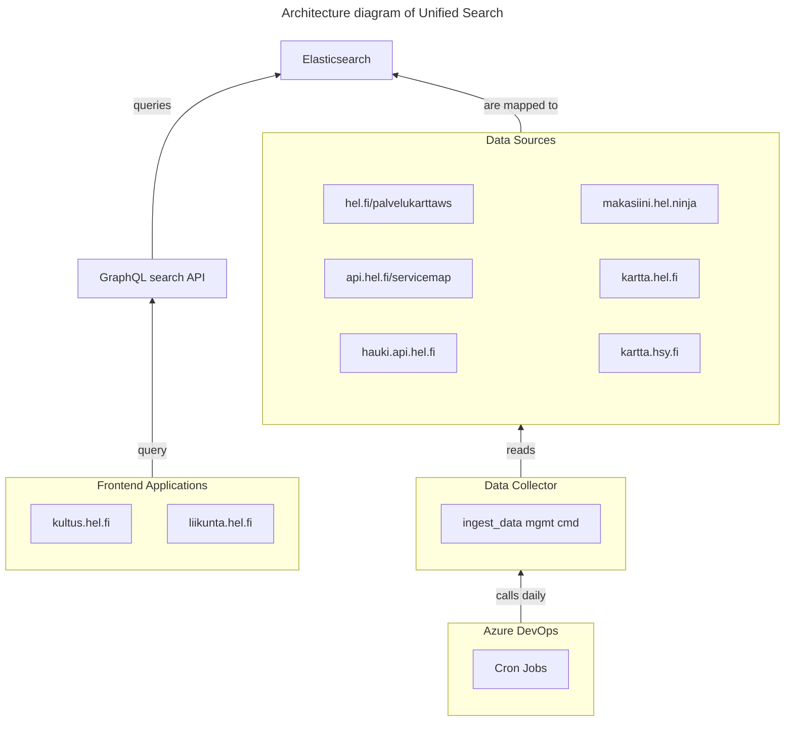

# Common unified search

This is common unified search: multi domain search over multiple services.

**Table of Contents**
<!-- DON'T EDIT THE TOC SECTION, INSTEAD RE-RUN md-toc TO UPDATE IT -->
<!--TOC-->

- [Applications](#applications)
  - [Elasticsearch](#elasticsearch)
  - [Data collector](#data-collector)
  - [GraphQL search API](#graphql-search-api)
- [Architecture](#architecture)
- [Development](#development)
  - [Running with Docker & Docker compose](#running-with-docker--docker-compose)
  - [Running without Docker](#running-without-docker)
  - [Running tests](#running-tests)
  - [Running data importers](#running-data-importers)
  - [Setting up pre-commit hooks](#setting-up-pre-commit-hooks)

<!--TOC-->

## Applications

Unified search consists of the following applications:

### Elasticsearch

- Search engine for indexing the data
- All environments use [Elasticsearch](https://www.elastic.co/elasticsearch), except local development, which uses [OpenSearch](https://opensearch.org/) 

### Data collector

- Python Django application for fetching data from multiple sources and storing it to Elasticsearch.
- Django management commands for importing data are triggered daily by Azure DevOps cron jobs.
- The [/sources/](./sources/) dir in this repository

See [Data collector README](./sources/README.md) for more info.

### GraphQL search API

- GraphQL search API on top of Elasticsearch providing high level interface for end (frontend) users
- The [/graphql/](./graphql/) dir in this repository

See [GraphQL search API README](./graphql/README.md) for more info.

## Architecture

## Development

### Running with Docker & Docker compose

1. First copy [.env.example](./.env.example) to `.env`
2. Then read the file's contents and set environment variables according to your environment
2. Configure your Docker to use at least 4 GB RAM so all services can be run simultaneously
3. Run `docker compose up` to start all services locally
4. Wait until all services are up and running (it takes a while)

Services can now be locally accessed at:

| Service                                   | Local URL                                    |
|-------------------------------------------|----------------------------------------------|
| [GraphQL search API](./graphql/README.md) | http://localhost:4000/search                 |
| OpenSearch Dashboards                     | http://localhost:5601                        |
| OpenSearch Dashboards Dev Tools           | http://localhost:5601/app/dev_tools#/console |
| OpenSearch                                | http://localhost:9200                        |
| [Data collector](./sources/README.md)     | http://localhost:5001/readiness              |

### Running without Docker

**Caveat emptor**:

    Running without Docker is not fully supported, so this setup may prove difficult. You have been warned.

1. First copy [.env.example](./.env.example) to `.env`
2. Then read the file's contents and set environment variables according to your environment
3. See the app specific READMEs for more info:
   - [Data collector README](./sources/README.md) (unsupported because of GDAL and other dependencies)
   - [GraphQL search API README](./graphql/README.md) (supported)

### Running tests

Sources tests, with `docker compose`:

    docker compose exec sources pytest

GraphQL tests under `graphql` folder (Install dependencies with `yarn` first):

    yarn test:ci

### Running data importers

For more info, see [Data Importers README](./sources/ingest/README.md),
but here are a few examples of importing data into unified search.

Import administrative division data:

    docker compose exec sources python manage.py ingest_data administrative_division

Import location data:

    docker compose exec sources python manage.py ingest_data location

### Setting up pre-commit hooks

You can use [`pre-commit`](https://pre-commit.com/) to lint and format your code before committing:

1. Install `pre-commit` (there are many ways to do that, but let's use pip as an example):
   - `pip install pre-commit`
2. Set up git hooks from `.pre-commit-config.yaml` by running these commands from project root:
   - `pre-commit install` to enable pre-commit code formatting & linting
   - `pre-commit install --hook-type commit-msg` to enable pre-commit commit message linting
3. To be able to successfully run the pre-commit hooks for the `graphql` app, you need to install its dependencies:
   - `yarn --cwd graphql` (Installs dependencies in the `graphql` folder)

After that, linting and formatting hooks will run against all changed files before committing.

Git commit message linting is configured in [.gitlint](./.gitlint)
