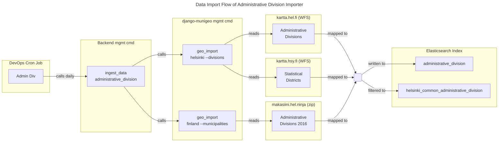
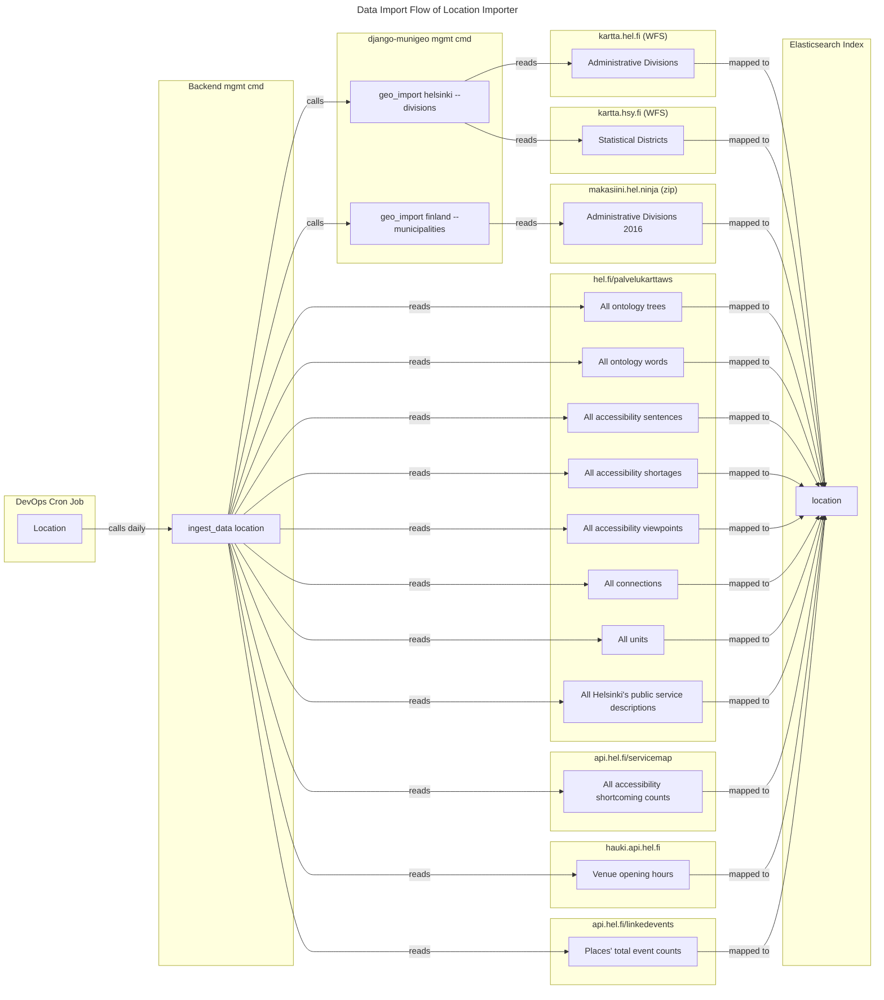
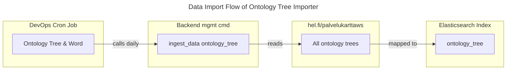
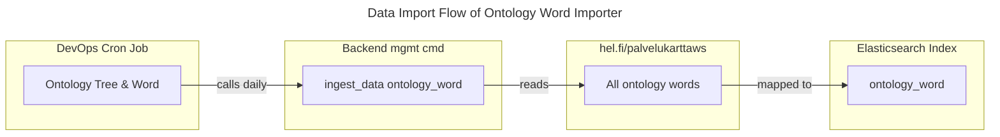

# Data importers

The data importers used for importing data into the unified search's
Elasticsearch index are located under this directory.

**Table of Contents**
<!-- DON'T EDIT THE TOC SECTION, INSTEAD RE-RUN md-toc TO UPDATE IT -->
<!--TOC-->

- [Architecture](#architecture)
  - [Administrative division importer](#administrative-division-importer)
    - [Imported administrative divisions](#imported-administrative-divisions)
    - [Data sources](#data-sources)
    - [Data import flow diagram](#data-import-flow-diagram)
  - [Location importer](#location-importer)
    - [Data import flow diagram](#data-import-flow-diagram-1)
  - [Ontology tree importer](#ontology-tree-importer)
    - [Data import flow diagram](#data-import-flow-diagram-2)
  - [Ontology word importer](#ontology-word-importer)
    - [Data import flow diagram](#data-import-flow-diagram-3)

<!--TOC-->

## Architecture

Azure DevOps [cron jobs](https://dev.azure.com/City-of-Helsinki/kuva-unified-search/_git/kuva-unified-search-pipelines?path=%2Fpipeline-templates%2Fdeploy-pipeline-unified-search-sources.yml)
call [ingest_data](./management/commands/ingest_data.py) Django management command with parameters:

| ingest_data parameter     | Used importer                                                       |
|---------------------------|---------------------------------------------------------------------|
| `administrative_division` | [AdministrativeDivisionImporter](#administrative-division-importer) |
| `location`                | [LocationImporter](#location-importer)                              |
| `ontology_tree`           | [OntologyTreeImporter](#ontology-tree-importer)                     |
| `ontology_word`           | [OntologyWordImporter](#ontology-word-importer)                     |

### Administrative division importer

[AdministrativeDivisionImporter](./importers/administrative_division.py) imports Helsinki/Finland
administrative divisions using [django-munigeo](https://github.com/City-of-Helsinki/django-munigeo) commands:
- `geo_import finland --municipalities` → [geo_import](https://github.com/City-of-Helsinki/django-munigeo/blob/release-0.3.12/munigeo/management/commands/geo_import.py) → [finland](https://github.com/City-of-Helsinki/django-munigeo/blob/release-0.3.12/munigeo/importer/finland.py) importer
- `geo_import helsinki --divisions` → [geo_import](https://github.com/City-of-Helsinki/django-munigeo/blob/release-0.3.12/munigeo/management/commands/geo_import.py) → [helsinki](https://github.com/City-of-Helsinki/django-munigeo/blob/release-0.3.12/munigeo/importer/helsinki.py) importer

#### Imported administrative divisions

- Municipalities (=kunnat)
  - Neighborhoods (=kaupunginosat)
  - Sub-districts (=osa-alueet)
  - Districts (=peruspiirit)

Info in Finnish about the [administrative divisions in Helsinki](https://fi.wikipedia.org/wiki/Helsingin_alueellinen_jako) in general.

#### Data sources

Based on django-munigeo [v0.3.12](https://github.com/City-of-Helsinki/django-munigeo/releases/tag/release-0.3.12) (2025-02-27):

The django-munigeo's `finland` importer uses the following source:
1. National Land Survey of Finland's division of Finland into administrative areas (vector), 1:1M scale, year 2016
   - Cached at and [used](https://github.com/City-of-Helsinki/django-munigeo/blob/release-0.3.12/munigeo/importer/finland.py#L35) from [makasiini.hel.ninja](https://makasiini.hel.ninja/TietoaKuntajaosta_2016_1000k.zip)
   - Cached file [taken](https://github.com/City-of-Helsinki/django-munigeo/blob/release-0.3.8/munigeo/importer/finland.py#L29) from [kartat.kapsi.fi](http://kartat.kapsi.fi/files/kuntajako/kuntajako_1000k/etrs89/gml/TietoaKuntajaosta_2016_1000k.zip)
     - Versions for each year between 2016–2025 [are available](https://kartat.kapsi.fi/files/kuntajako/kuntajako_1000k/etrs89/gml/)
   - Originally from National Land Survey of Finland (Maanmittauslaitos), see docs:
     - [Division into administrative areas (vector)](https://www.maanmittauslaitos.fi/en/maps-and-spatial-data/datasets-and-interfaces/product-descriptions/division-administrative-areas-vector)
     - [Specification for the used year 2016 version (In Finnish)](https://xml.nls.fi/Kuntajako/Asiakasdokumentaatio/Tietotuoteselosteet/tietotuoteseloste_kuntajako_2016_1000k.pdf)

The django-munigeo's `helsinki` importer uses the following sources:
1. [City of Helsinki's Open Data WFS-service](https://kartta.hel.fi/avoindata/dokumentit/HKI_wfs-avoin-data-kuvaus.pdf) at [kartta.hel.fi/ws/geoserver/avoindata/wfs](https://kartta.hel.fi/ws/geoserver/avoindata/wfs?request=GetCapabilities)
   - "Helsingin kaupunkimittauspalveluiden ylläpitämä WFS-rajapintapalvelu" in Finnish
   - [Used WFS layers](https://github.com/City-of-Helsinki/django-munigeo/blob/release-0.3.12/munigeo/data/fi/helsinki/config.yml):
     - Major districts / `avoindata:Piirijako_suurpiiri` (=Suurpiirit)
     - Districts / `avoindata:Piirijako_peruspiiri` (=Peruspiirit)
     - Sub-districts / `avoindata:Piirijako_osaalue` (=Osa-alueet)
     - Small districts / `avoindata:Piirijako_pienalue` (=Pienalueet)
     - Neighborhoods /  `avoindata:Kaupunginosajako` (=Kaupunginosat)
     - Voting districts / `avoindata:Halke_aanestysalue` (=Äänestysalueet)
     - Postcodes / `avoindata:Postinumeroalue` (=Postinumeroalueet)
2. [Helsinki Region Environmental Services Authority (HSY)](https://www.hsy.fi/en/)'s WFS-service at [kartta.hsy.fi/geoserver/wfs](https://kartta.hsy.fi/geoserver/wfs?request=GetCapabilities)
   - [Used WFS layers](https://github.com/City-of-Helsinki/django-munigeo/blob/release-0.3.12/munigeo/data/fi/helsinki/config.yml):
     - Statistical districts / `taustakartat_ja_aluejaot:seutukartta_pien_2021` only for municipalities:
       - Helsinki / [091](https://stat.fi/fi/luokitukset/kunta/kunta_1_20250101/code/091)
       - Vantaa / [092](https://stat.fi/fi/luokitukset/kunta/kunta_1_20250101/code/092)
       - Espoo / [049](https://stat.fi/fi/luokitukset/kunta/kunta_1_20250101/code/049)
       - Kauniainen / [235](https://stat.fi/fi/luokitukset/kunta/kunta_1_20250101/code/235)

#### Data import flow diagram

### Location importer

Terms `location`, `place`, `unit` and `venue` are used interchangeably, and they mean the same thing.

[LocationImporter](./importers/location/importers.py) imports data from the following sources:
1. [REST API for City of Helsinki Service Map](https://www.hel.fi/palvelukarttaws/restpages/ver4_en.html) (Closed source application by CGI)
   - [All accessibility sentences](https://www.hel.fi/palvelukarttaws/restpages/ver4_en.html#_find_all_accessibility_sentences) from [accessibility_sentence](https://www.hel.fi/palvelukarttaws/rest/v4/accessibility_sentence/) endpoint
   - [All accessibility shortages](https://www.hel.fi/palvelukarttaws/restpages/ver4_en.html#_find_all_accessibility_shortages) from [accessibilitity_shortage](https://www.hel.fi/palvelukarttaws/rest/v4/accessibility_shortage/) endpoint
   - [All accessibility viewpoints](https://www.hel.fi/palvelukarttaws/restpages/ver4_en.html#_find_all_accessibility_viewpoints) from [accessibility_viewpoint](https://www.hel.fi/palvelukarttaws/rest/v4/accessibility_viewpoint/) endpoint
   - [All connections](https://www.hel.fi/palvelukarttaws/restpages/ver4_en.html#_find_all_connections) from [connection](https://www.hel.fi/palvelukarttaws/rest/v4/connection/) endpoint
   - [All units](https://www.hel.fi/palvelukarttaws/restpages/ver4_en.html#_filter_units) from [unit](https://www.hel.fi/palvelukarttaws/rest/v4/unit/?newfeatures=yes) endpoint
2. [TPR Service Description Register REST API](https://www.hel.fi/palvelukarttaws/restpages/palvelurekisteri_en.html) (Closed source application by CGI)
   - All Helsinki's public service descriptions from [description](https://www.hel.fi/palvelukarttaws/rest/vpalvelurekisteri/description/?alldata=yes) endpoint
3. [Service Map Backend](https://github.com/City-of-Helsinki/smbackend) (Open source)
   - All accessibility shortcoming counts from [unit](https://api.hel.fi/servicemap/v2/unit/?format=json&only=accessibility_shortcoming_count&page_size=1000) endpoint (with pagination)
4. Same data sources as [administrative division importer](#administrative-division-importer)
   - These are used to add administrative division information to the location data
5. [Helsinki Opening hours API / Hauki](https://github.com/City-of-Helsinki/hauki) (Open source)
   - Opening hours for venues from [opening_hours](https://hauki.api.hel.fi/v1/opening_hours/) endpoint
6. [Linked Events API](https://github.com/City-of-Helsinki/linkedevents) (Open source)
   - Total event count for each venue from [place endpoint](https://api.hel.fi/linkedevents/v1/place/) (with pagination)

#### Data import flow diagram

### Ontology tree importer

[OntologyTreeImporter](./importers/ontology_tree.py) imports data from the following source:
- [REST API for City of Helsinki Service Map](https://www.hel.fi/palvelukarttaws/restpages/ver4_en.html) (Closed source application by CGI):
  - All ontology trees from the [ontologytree](https://www.hel.fi/palvelukarttaws/restpages/ver4.html#_find_all_ontology_trees) endpoint

#### Data import flow diagram

### Ontology word importer

[OntologyWordImporter](./importers/ontology_word.py) imports data from the following source:
- [REST API for City of Helsinki Service Map](https://www.hel.fi/palvelukarttaws/restpages/ver4_en.html) (Closed source application by CGI):
  - All ontology words from the [ontologyword](https://www.hel.fi/palvelukarttaws/restpages/ver4.html#_find_all_ontology_words) endpoint

#### Data import flow diagram

